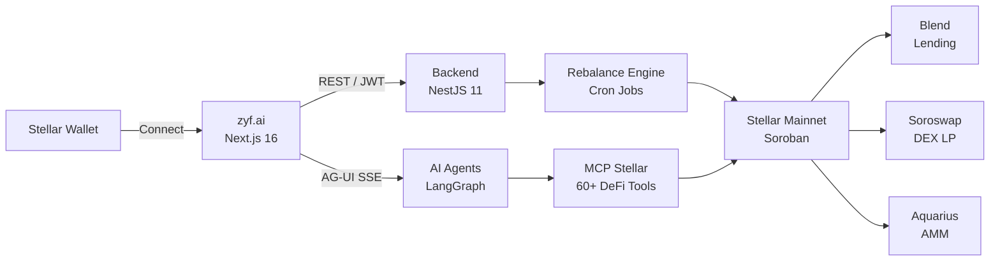

  

<h1 align="center">Tasmil Finance</h1>

  <strong>AI-managed yield vaults on Stellar/Soroban</strong> 
  Smart, automated DeFi portfolio management for the Stellar ecosystem

  
  
  
  

---

## What We Build

Tasmil Finance ([zyf.ai](https://zyf.ai)) lets users deploy capital into yield-generating strategies on Stellar — Blend lending, Soroswap LP, and Aquarius AMM — with AI agents handling rebalancing, risk management, and optimization automatically.

Users connect a Stellar wallet, choose a risk preset (Safe / Balanced / Aggressive), fund a personal keeper-wallet contract, and let the system do the rest.

---

## How It Works

1. **Connect** — Link your Stellar wallet via Freighter, xBull, or WalletConnect
2. **Choose** — Select USDC or XLM as base asset and a risk preset
3. **Fund** — Send assets to your personal keeper-wallet contract
4. **Earn** — AI agents discover the highest-yielding pools, allocate capital, and rebalance automatically

---

## Repositories

### Public

| Repository | Description | Stack |
|------------|-------------|-------|
| [frontend](https://github.com/Tasmil-Finance/frontend) | Web application at zyf.ai | Next.js 16, React 19, TailwindCSS 4 |
| [mcp-stellar](https://github.com/Tasmil-Finance/mcp-stellar) | 60+ Stellar DeFi tools via MCP | TypeScript, Stellar SDK 14 |
| [user-docs](https://github.com/Tasmil-Finance/user-docs) | User-facing documentation site | Fumadocs, Next.js |

### Private

| Repository | Description | Stack |
|------------|-------------|-------|
| backend | API server + automated rebalance engine | NestJS 11, Prisma 7, PostgreSQL |
| ai | 13 LangGraph AI agents + supervisor | Python 3.12, LangGraph, AG-UI |
| contracts | Soroban smart contracts | Rust, Soroban SDK |

---

## Supported Protocols

| Protocol | Type | Network |
|----------|------|---------|
| Blend Capital | Lending / Borrowing | Stellar Mainnet |
| Soroswap | DEX / Liquidity Pools | Stellar Mainnet |
| Aquarius AMM | Stable AMM | Stellar Mainnet |
| Phoenix | DEX (swap routing) | Stellar Mainnet |
| DeFindex | Yield Vaults | Stellar Mainnet |
| SDEX | Orderbook DEX | Stellar Mainnet |
| Allbridge | Cross-chain Bridge | Stellar ↔ EVM |

---

## AI Agents

13 specialized agents coordinated by a supervisor handle every DeFi operation:

| Agent | Specialization |
|-------|---------------|
| `supervisor` | Multi-agent orchestration and planning |
| `blend_agent` | Blend Capital lending and borrowing |
| `soroswap_agent` | Soroswap DEX LP management |
| `aquarius_agent` | Aquarius AMM integration |
| `phoenix_agent` | Phoenix DEX operations |
| `sdex_agent` | Stellar DEX orderbook trading |
| `defindex_agent` | DeFindex vault management |
| `templar_agent` | Templar protocol |
| `allbridge_agent` | Cross-chain bridge operations |
| `info_agent` | Account state and DeFi positions |
| `research_agent` | Market intelligence (CoinGecko, DeFiLlama) |
| `yield_agent` | Cross-protocol yield optimization |

---

## Tech Stack

| Layer | Technology |
|-------|------------|
| Frontend | Next.js 16, React 19, TailwindCSS 4, Stellar Wallets Kit, AG-UI |
| Backend | NestJS 11, Prisma 7, PostgreSQL 16, Redis |
| AI | Python 3.12, LangGraph, Starlette, AG-UI Protocol |
| Tooling | MCP Protocol, 60+ Stellar DeFi tools |
| Contracts | Rust, Soroban SDK, Stellar CLI |
| Infrastructure | Docker, Turborepo, pnpm workspaces |

---

  Built for autonomous, secure, cross-protocol DeFi on Stellar.

